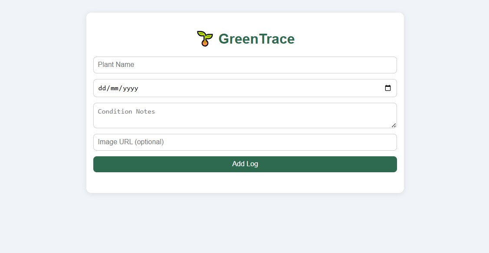

🌱 GreenTrace – Plant Growth Logger

GreenTrace is a decentralized application designed to help individuals or urban farming communities record the growth and health of their plants over time. Whether you're a gardening enthusiast, a community farmer, or part of a school project, GreenTrace enables you to track planting dates, daily notes, plant condition, and photo logs — all stored securely on the Internet Computer (ICP) blockchain.

---

## Features

- Log planting dates and daily growth
- Record notes and observations
- Upload photo links of plant condition
- Track plant health and development
- All data is stored **onchain**
- Great for gardening clubs, schools, or urban farming communities

---

## Deploy via ICP Ninja

Want to try it out instantly? Launch the app in your browser using ICP Ninja:

[](https://icp.ninja/editor)

---

## Local Deployment

Follow these steps to run the project locally:

1. [Install the DFINITY SDK](https://internetcomputer.org/docs/build/install/)
2. Clone or download this project:

```
git clone https://github.com/cynesigethelstan/GreenTrace
cd GreenTrace
```

Start the local Internet Computer replica and deploy:

```
dfx start --background --clean
dfx deploy --network=ic
```

✅ This app is ready for MAINNET deployment.

---

## Screenshot
Here’s a preview of GreenTrace in action:
<div align="center">
  
</div>

---

## Security Considerations
If you plan to extend or productionize this app, be sure to review ICP security best practices. This example is for educational purposes and may not include all production-grade safeguards.

---

## License
This project is licensed under the MIT License.
